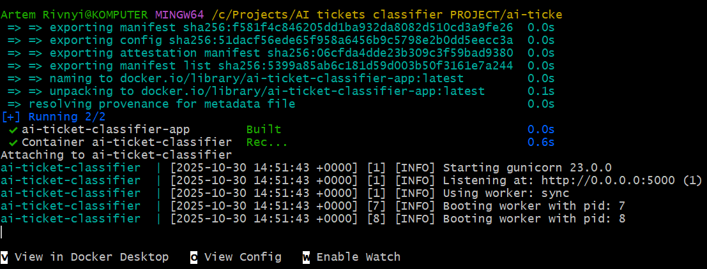
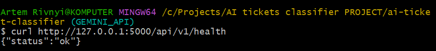
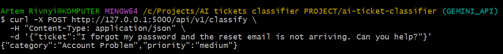
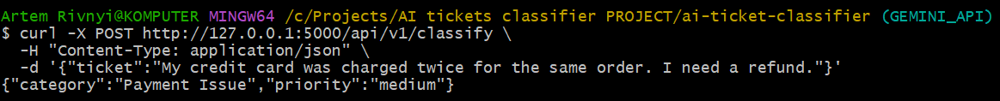
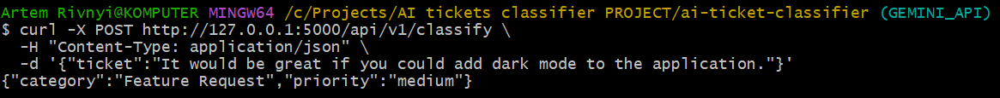
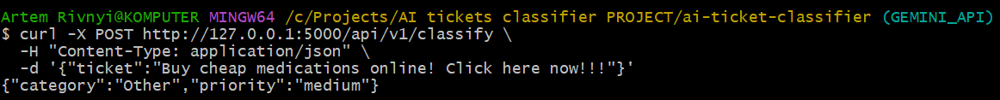
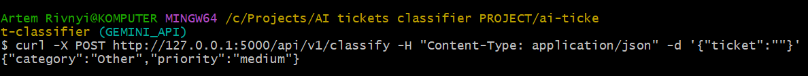
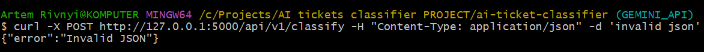
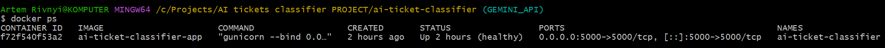
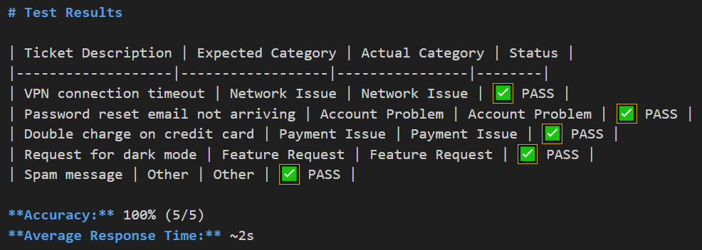

# 🤖 AI Ticket Classifier (Gemini API Version)

[](https://www.python.org/)
[](https://flask.palletsprojects.com/)
[](https://ai.google.dev/gemini-api)
[](https://opensource.org/licenses/MIT)
[<image-card alt="CI" src="https://github.com/ArtemRivnyi/ai-ticket-classifier/actions/workflows/ci.yml/badge.svg" ></image-card>](https://github.com/ArtemRivnyi/ai-ticket-classifier/actions/workflows/ci.yml)
[](https://github.com/ArtemRivnyi/ai-ticket-classifier/actions )
[](https://github.com/ArtemRivnyi/ai-ticket-classifier/commits/main )

**AI Ticket Classifier** is a lightweight, AI-powered backend built with **Flask**, **Google Gemini API**, and **Docker Compose**. It automatically classifies incoming support tickets into categories such as *Network Issue*, *Account Problem*, or *Payment Issue*. Ideal for small tech teams, helpdesks, or e-commerce support operations seeking efficient ticket management.

---

## 📝 Table of Contents

- [✨ Features](#-features)
- [🛠️ Technologies Used](#️-technologies-used)
- [📸 Screenshots](#-Screenshots)
- [🚀 Quick Start](#-quick-start)
  - [1️⃣ Clone the Repository](#1️⃣-clone-the-repository)
  - [2️⃣ Configure API Key](#2️⃣-configure-api-key)
  - [3️⃣ Run with Docker Compose](#3️⃣-run-with-docker-compose)
  - [4️⃣ Test the API](#4️⃣-test-the-api)
- [🧪 Testing](#-testing)
- [🔧 Development](#-development)
- [🧩 Example Categories](#-example-categories)
- [🔄 API Migration](#-api-migration)
- [📊 CI/CD Status](#-ci/cd-status)
- [🧠 Planned Improvements](#-planned-improvements)
- [📄 License](#-license)
- [🧰 Maintainer](#-maintainer)

---

## ✨ Features

- 🧠 **AI-Powered Classification**: Leverages the advanced capabilities of Google Gemini 2.0 Flash for accurate and efficient ticket categorization.
- ⚙️ **RESTful API**: Provides well-defined `/api/v1/classify` and `/api/v1/health` endpoints for seamless integration and monitoring.
- 🐳 **Docker & Docker Compose Ready**: Facilitates rapid deployment across various environments, enabling setup in mere seconds.
- 🔁 **Automated Resilience**: Includes automatic restart mechanisms and container health monitoring to ensure continuous service availability.
- 💡 **Extensible Design**: Engineered for easy expansion with new classification categories and support for multiple languages.
- 💰 **Cost-Effective**: Utilizes the Google Gemini API, which offers a generous free tier, making it a budget-friendly solution.
- ✅ **CI/CD Ready**: Integrated with GitHub Actions for automated testing and deployment workflows.
- ✅ **Input Validation**: Uses pydantic for robust request validation, ensuring reliable API interactions.

---

## 🛠️ Technologies Used

The project is built upon a robust stack of modern technologies:

- **Python**: Version 3.10+ for core application logic.
- **Flask**: A micro web framework for building the RESTful API.
- **Gunicorn**: A Python WSGI HTTP Server for UNIX, used for production deployments.
- **Docker & Docker Compose**: For containerization and orchestration, ensuring consistent environments.
- **Google Gemini API**: Specifically `gemini-2.0-flash` for AI-powered text classification.
- **GitHub Actions**: For Continuous Integration and Continuous Deployment (CI/CD).
- **Pytest**: A powerful testing framework for Python.
- **Pydantic**: For data validation and settings management.
---

## 📸 Screenshots

#### Application Startup


*Successful application startup with Gunicorn workers initialized*

#### Health Check Endpoint


*API health check confirming the service is running*

#### Network Issue Classification

 
*VPN connection problem correctly identified as Network Issue*

#### Account Problem Classification


*Password reset request classified as Account Problem*

#### Payment Issue Classification


*Double charge complaint identified as Payment Issue*

#### Feature Request Classification


*Dark mode suggestion classified as Feature Request*

#### Spam Detection

 
*Spam message correctly categorized as Other*

---

### Error Handling

#### Empty Ticket Validation


*API properly validates and rejects empty ticket submissions*

#### Invalid JSON Handling


*Malformed JSON requests are caught and handled gracefully*

#### Running Container


*Container running with healthy status after 2 hours uptime*

#### Test Results

 
*All test cases successfully executed with expected classifications*


---

## 🚀 Quick Start

Follow these steps to get the AI Ticket Classifier up and running quickly:

### 1️⃣ Clone the Repository

Begin by cloning the project repository to your local machine:

```bash
git clone https://github.com/ArtemRivnyi/ai-ticket-classifier.git
cd ai-ticket-classifier
```

### 2️⃣ Configure API Key

Create a `.env` file in the root directory of the project and add your Google Gemini API key:

```env
GEMINI_API_KEY=your_gemini_api_key_here
```

Obtain your API key from [Google AI Studio](https://aistudio.google.com/app/apikey).

### 3️⃣ Run with Docker Compose

Build and start the service using Docker Compose:

```bash
docker compose up --build
```

To stop the service, execute:

```bash
docker compose down
```

### 4️⃣ Test the API

Verify the deployment and functionality of the API:

#### Health Check

```bash
curl http://127.0.0.1:5000/api/v1/health
```

#### Classify a Ticket

Send a POST request to the classify endpoint with a sample ticket:

```bash
curl -X POST http://127.0.0.1:5000/api/v1/classify \
-H "Content-Type: application/json" \
-d '{"ticket":"I cannot connect to the VPN"}'
```

**Expected Response:**

```json
{
  "category": "Network Issue"
}
```

---

## 🧪 Testing

Run the test suite to ensure everything is working as expected:

# Install test dependencies
```bash
pip install -r requirements.txt  # Includes pytest and pytest-mock
```

# Run all tests (test file is in root directory)
```bash
python -m pytest test_app.py -v
```
# Or run all tests in project
```bash
python -m pytest . -v
```

#Expected Response:
```json
{
  "category": "Network Issue",
  "priority": "medium"
}
```
---

## 🔧 Development

For local development without Docker:

```bash
pip install -r requirements.txt
python app.py
```

Running tests during development:

```bash
python -m pytest test_app.py -v
```

Code quality checks:

```bash
pip install flake8 pylint
flake8 . --count --select=E9,F63,F7,F82 --show-source --statistics
pylint app.py classify.py test_app.py
```

---

## 🧩 Example Categories

This table illustrates typical ticket categories and corresponding examples:

| Category        | Example Ticket                               |
| :-------------- | :------------------------------------------- |
| Network Issue   | "VPN not connecting", "Wi-Fi drops constantly" |
| Account Problem | "Can't log in", "Password reset fails"     |
| Payment Issue   | "Refund request", "Invoice missing"        |
| Feature Request | "Add dark mode"                              |
| Other           | Any other unlisted issue                     |

---

## 🔄 API Migration

This project has transitioned from OpenAI GPT to the Google Gemini API, offering several key advantages:

- **Cost-Effective**: Benefits from a generous free tier, reducing operational costs.
- **Fast Responses**: Utilizes the `gemini-2.0-flash` model for rapid classification.
- **Easy Integration**: Features straightforward API calls for seamless implementation.

For the legacy OpenAI version of this project, please refer to the `OPENAI` branch.

---

## 📊 CI/CD Status

This project uses GitHub Actions for continuous integration, ensuring code quality and reliability:

- ✅ Automated testing on every push
- ✅ Docker image building and testing
- ✅ Security scanning
- ✅ Code quality checks

---

## 🧠 Planned Improvements

Future enhancements are envisioned to further improve the classifier's robustness and feature set:

- **Retry Logic**: Introduction of retry mechanisms to handle API rate limits gracefully.
- **Enhanced Error Handling**: Improved error management for more resilient operations.
- **Cloud Deployment**: Guides and configurations for deployment on platforms like Render, Railway, or AWS.
- **Structured Logging and Metrics**: Enhanced logging for better observability and performance monitoring.
- **Multilingual Ticket Support**: Expansion to classify tickets in multiple languages.
- **Web Dashboard**: Development of a web interface for ticket review and knowledge base management.

---

## 📄 License

This project is licensed under the MIT License - see the [LICENSE](LICENSE) file for details.

---

## 🧰 Maintainer

**Artem Rivnyi** — Junior Technical Support / DevOps Enthusiast

* 📧 [artemrivnyi@outlook.com](mailto:artemrivnyi@outlook.com)  
* 🔗 [LinkedIn](https://www.linkedin.com/in/artem-rivnyi/)  
* 🌐 [Personal Projects](https://personal-page-devops.onrender.com/)  
* 💻 [GitHub](https://github.com/ArtemRivnyi)
