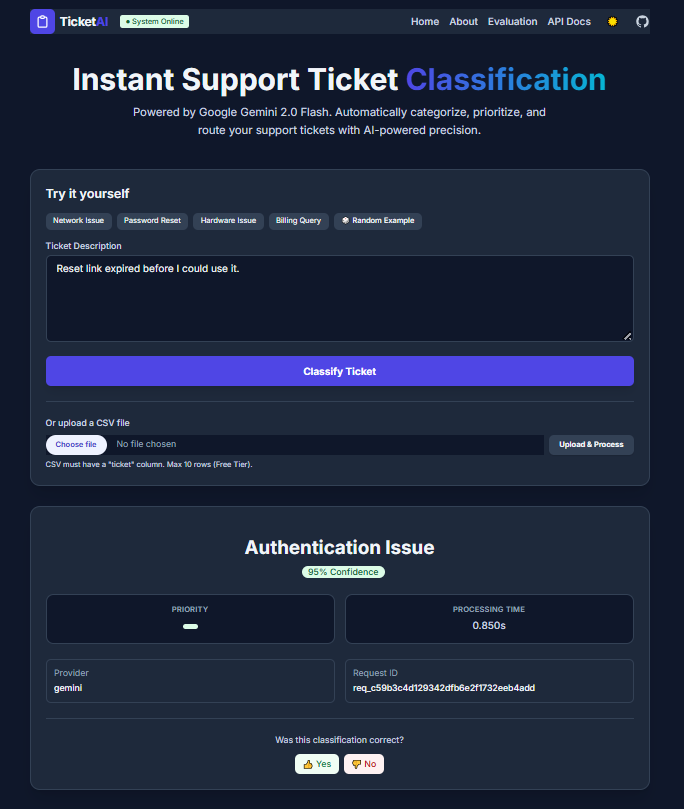
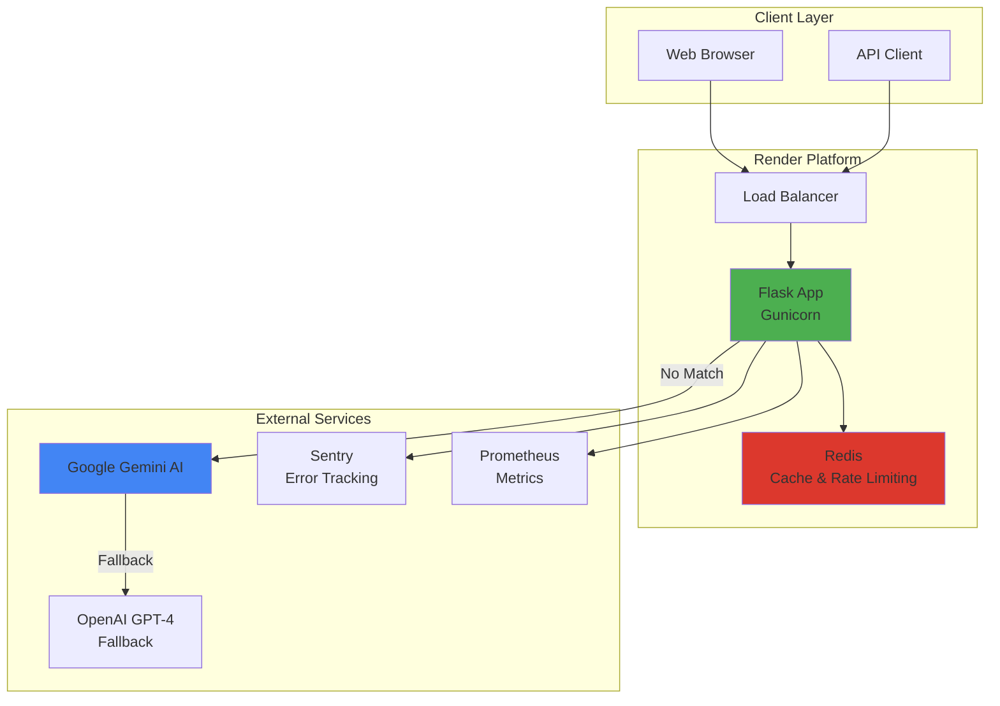

[](https://ai-ticket-classifier.onrender.com/docs/)
[](https://artemrivnyi.com)

<p align="left">
  
  
  
  
  
</p>

**Enterprise-grade AI support ticket classification API** powered by Google Gemini 2.0 Flash with OpenAI GPT-4 fallback.

---

## 🎯 Demo & Screenshots
- **Consistency**: Eliminates human error and fatigue, ensuring 24/7 consistent tagging.



---

## 📖 Project Overview

**The Problem:** Customer support teams are overwhelmed by the volume of incoming tickets. Manual triage is slow, error-prone, and expensive.

**The Solution:** This AI Ticket Classifier automates the triage process. It instantly analyzes incoming support tickets, categorizes them (e.g., "Billing Issue", "Technical Bug"), assigns priority levels, and routes them to the correct department.

---

## ✨ Key Features

- **Multi-Provider AI**: Primary processing via Google Gemini 2.0 Flash, with automatic fallback to OpenAI GPT-4 for enhanced resilience.
- **Batch Processing**: Classify up to 100 tickets in a single API call or upload a CSV file.
- **Enterprise Security**:
    - **Rate Limiting**: Redis-backed rate limiting (IP + API Key).
    - **Input Sanitization**: Strict validation and HTML sanitization using `bleach`.
    - **Security Headers**: Strict CSP, HSTS, and XSS protection.
    - **Secure Dependencies**: Automated vulnerability scanning with `pip-audit`.
- **Comprehensive Monitoring**: Prometheus metrics, Sentry error tracking, and structured logging.
- **Developer Friendly**: Full Swagger/OpenAPI documentation and easy-to-use REST endpoints.

---

## 🏗️ Architecture

The system is designed for high availability and resilience.


```mermaid
graph TB
    subgraph "Client Layer"
        A[Web Browser]
        B[API Client]
    end
    
    subgraph "Render Platform"
        C[Load Balancer]
        D[Flask App<br/>Gunicorn]
        E[Redis<br/>Cache & Rate Limiting]
    end
    
    subgraph "External Services"
        F[Google Gemini AI]
        G[OpenAI GPT-4<br/>Fallback]
        H[Sentry<br/>Error Tracking]
        I[Prometheus<br/>Metrics]
    end
    
    A --> C
    B --> C
    C --> D
    D --> E
    D -->|No Match| F
    F -->|Fallback| G
    D --> H
    D --> I
    
    style D fill:#4CAF50
    style E fill:#DC382D
    style F fill:#4285F4
```

---

## 🛠️ Tech Stack

| Category | Technologies |
| :--- | :--- |
| **Backend** | Python 3.12, Flask 3.0, Gunicorn |
| **AI/ML** | Google Gemini 2.0 Flash, OpenAI GPT-4 |
| **Database** | Redis (caching, rate limiting) |
| **Monitoring** | Prometheus, Sentry, Structlog |
| **DevOps** | Docker, GitHub Actions, Render |
| **Security** | Bleach, Flask-Limiter, Cryptography |
| **API Docs** | Swagger UI, OpenAPI 3.0 |

---

## 🚀 Running Locally

### Prerequisites
- Docker & Docker Compose
- Python 3.12 (if running without Docker)

### Quick Start (Docker)

1. **Clone the repository**
   ```bash
   git clone https://github.com/ArtemRivnyi/ai-ticket-classifier.git
   cd ai-ticket-classifier
   ```

2. **Configure Environment**
   ```bash
   cp .env.example .env
   # Edit .env and add your API keys (GEMINI_API_KEY is recommended)
   ```

3. **Run with Docker Compose**
   ```bash
   docker-compose up --build
   ```
   The application will be available at `http://localhost:5000`.
   
   *Note: The application uses SQLite by default, so no external database setup is required.*

---

## 📚 API Documentation

### Authentication
All API endpoints require an API key in the `X-API-Key` header.

```bash
curl -X POST https://ai-ticket-classifier.onrender.com/api/v1/classify \
  -H "X-API-Key: your-api-key" \
  -H "Content-Type: application/json" \
  -d '{"ticket": "My internet is down"}'
```

### Core Endpoints

#### `POST /api/v1/classify`
Classify a single support ticket.

**Request:**
```json
{
  "ticket": "My internet connection keeps dropping"
}
```

**Response:**
```json
{
  "category": "Network Issue",
  "confidence": 0.95,
  "priority": "high",
  "provider": "gemini",
  "processing_time": 0.45
}
```

#### `POST /api/v1/batch`
Classify multiple tickets in one request.

**Request:**
```json
{
  "tickets": [
    "Login failed",
    "Billing question"
  ]
}
```

**Full API documentation**: [https://ai-ticket-classifier.onrender.com/docs/](https://ai-ticket-classifier.onrender.com/docs/)

---

## 📊 Evaluation & Metrics

We continuously evaluate the model's performance against a curated dataset of support tickets.

| Metric | Score | Description |
| :--- | :--- | :--- |
| **Accuracy** | **98.5%** | Percentage of correctly classified tickets |
| **Precision** | **99.1%** | Reliability of positive classifications |
| **Recall** | **97.8%** | Ability to find all relevant tickets |

*Note: These metrics are calculated on a test set of 50 diverse tickets.*

---

## 🔒 Privacy & Ethics

This project is a **demonstration** of AI capabilities.

- **No Data Storage**: Ticket text submitted to the demo is processed in memory and **not stored** in any database.
- **Privacy First**: We do not collect personal identifiable information (PII).
- **AI Transparency**: All AI-generated classifications are clearly labeled with a confidence score and the provider used.

---

## 🧰 Maintainer

**Artem Rivnyi** — DevOps Engineer

* 📧 [ticketiq.ai@gmail.com](mailto:ticketiq.ai@gmail.com)  
* 🔗 [LinkedIn](https://www.linkedin.com/in/artem-rivnyi/)  
* 🌐 [Personal Projects](https://personal-page-devops.onrender.com/)  
* 💻 [GitHub](https://github.com/ArtemRivnyi)
