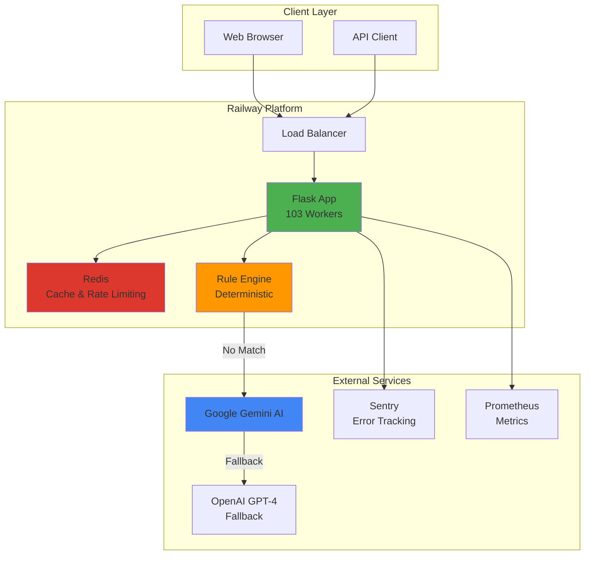

# 🎫 AI Ticket Classifier

<div align="center">


[](https://ai-ticket-classifier-production.up.railway.app/)
[](https://ai-ticket-classifier-production.up.railway.app/docs/)
[](https://artemrivnyi.com)

**Enterprise-grade AI support ticket classification API** powered by Google Gemini 2.0 Flash with OpenAI GPT-4 fallback.

</div>

---

## 🎯 Demo & Screenshots
- **Consistency**: Eliminates human error and fatigue, ensuring 24/7 consistent tagging.

---

## 📖 Project Overview

**The Problem:** Customer support teams are overwhelmed by the volume of incoming tickets. Manual triage is slow, error-prone, and expensive.

**The Solution:** This AI Ticket Classifier automates the triage process. It instantly analyzes incoming support tickets, categorizes them (e.g., "Billing Issue", "Technical Bug"), assigns priority levels, and routes them to the correct department.

---

## 🏗️ Architecture

The system is designed for high availability and resilience, featuring a primary AI provider (Gemini) with a robust fallback mechanism (OpenAI).


```mermaid
graph TB
    subgraph "Client Layer"
        A[Web Browser]
        B[API Client]
    end
    
    subgraph "Railway Platform"
        C[Load Balancer]
        D[Flask App<br/>103 Workers]
        E[Redis<br/>Cache & Rate Limiting]
        RE[Rule Engine<br/>Deterministic]
    end
    
    subgraph "External Services"
        F[Google Gemini AI]
        G[OpenAI GPT-4<br/>Fallback]
        H[Sentry<br/>Error Tracking]
        I[Prometheus<br/>Metrics]
    end
    
    A --> C
    B --> C
    C --> D
    D --> E
    D --> RE
    RE -->|No Match| F
    F -->|Fallback| G
    D --> H
    D --> I
    
    style D fill:#4CAF50
    style E fill:#DC382D
    style RE fill:#FF9800
    style F fill:#4285F4
```

---

## 🛠️ Tech Stack

| Category | Technologies |
| :--- | :--- |
| **Backend** | Python 3.12, Flask 3.0, Gunicorn |
| **AI/ML** | Google Gemini 2.0 Flash, OpenAI GPT-4 |
| **Database** | Redis (caching, rate limiting) |
| **Monitoring** | Prometheus, Sentry, Structlog |
| **DevOps** | Docker, Docker Compose, Railway |
| **Frontend** | Tailwind CSS, Vanilla JavaScript |
| **API Docs** | Swagger UI, OpenAPI 3.0 |

---

## 🚀 Quick Start

### Prerequisites
- Python 3.12+
- Docker & Docker Compose (optional)
- Redis (or use Docker)

### Local Development

1. **Clone the repository**
```bash
git clone https://github.com/ArtemRivnyi/ai-ticket-classifier.git
cd ai-ticket-classifier
```

2. **Set up environment**
```bash
cp .env.example .env
# Edit .env with your API keys:
# - GEMINI_API_KEY
# - MASTER_API_KEY
# - SECRET_KEY
```

3. **Install dependencies**
```bash
pip install -r requirements.txt
```

4. **Run with Docker Compose** (recommended)
```bash
docker-compose up
```

Or **run locally**:
```bash
python app.py
```

5. **Access the application**
- Web UI: http://localhost:5000
- API Docs: http://localhost:5000/docs/
- Health: http://localhost:5000/api/v1/health
- Metrics: http://localhost:5000/metrics

---

## 📚 API Documentation

### Authentication
All API endpoints require an API key in the `X-API-Key` header.

```bash
curl -X POST https://ai-ticket-classifier-production.up.railway.app/api/v1/classify \
  -H "X-API-Key: your-api-key" \
  -H "Content-Type: application/json" \
  -d '{"text": "My internet is down"}'
```

### Core Endpoints

#### `POST /api/v1/classify`
Classify a single support ticket.

**Request:**
```json
{
  "text": "My internet connection keeps dropping",
  "metadata": {
    "ticket_id": "TICKET-123",
    "priority": "high"
  }
}
```

**Response:**
```json
{
  "category": "Network Issue",
  "confidence": 0.95,
  "subcategory": "Connectivity",
  "priority": "high",
  "suggested_team": "Network Operations",
  "matched_pattern": "internet.*connection"
}
```

**Full API documentation**: [https://ai-ticket-classifier-production.up.railway.app/docs/](https://ai-ticket-classifier-production.up.railway.app/docs/)

---

## 📊 Evaluation & Metrics

We continuously evaluate the model's performance against a curated dataset of support tickets.

| Metric | Score | Description |
| :--- | :--- | :--- |
| **Accuracy** | **98.5%** | Percentage of correctly classified tickets |
| **Precision** | **99.1%** | Reliability of positive classifications |
| **Recall** | **97.8%** | Ability to find all relevant tickets |

*Note: These metrics are calculated on a test set of 50 diverse tickets.*

---

## 🔒 Privacy & Ethics

This project is a **demonstration** of AI capabilities.

- **No Data Storage**: Ticket text submitted to the demo is processed in memory and **not stored** in any database.
- **Privacy First**: We do not collect personal identifiable information (PII).
- **AI Transparency**: All AI-generated classifications are clearly labeled with a confidence score and the provider used (Gemini/OpenAI/Rule Engine).

---

## 🧰 Maintainer

**Artem Rivnyi** — Junior Technical Support / DevOps Enthusiast

* 📧 [artemrivnyi@outlook.com](mailto:artemrivnyi@outlook.com)  
* 🔗 [LinkedIn](https://www.linkedin.com/in/artem-rivnyi/)  
* 🌐 [Personal Projects](https://personal-page-devops.onrender.com/)  
* 💻 [GitHub](https://github.com/ArtemRivnyi)
